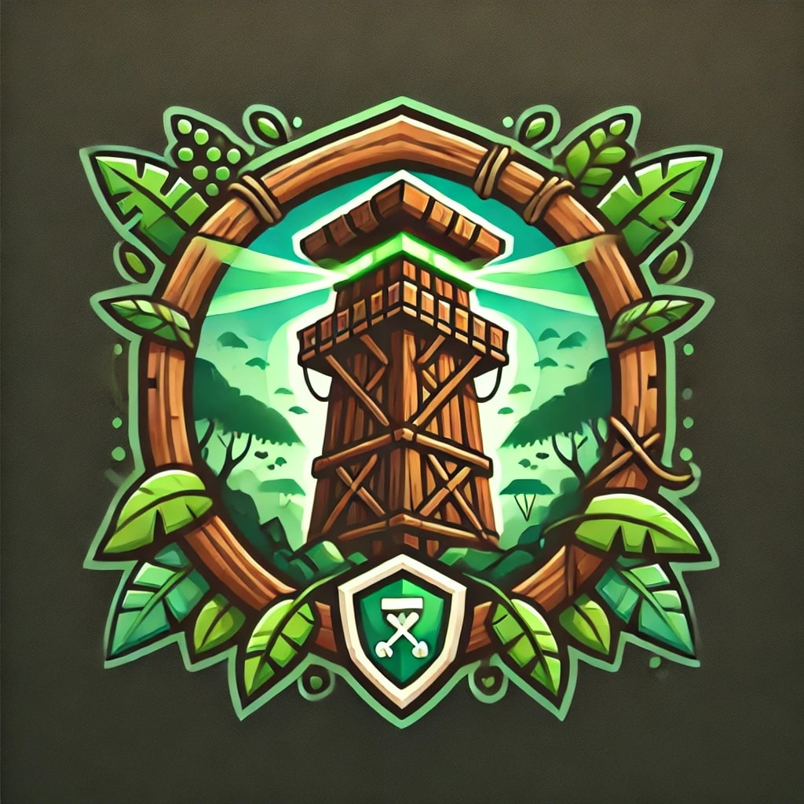

<table>
  <tr>
    <td><h1>Tower Defense - Consciência Ambiental</h1></td>
    <td></td>
  </tr>
</table>

## 🌱 Sobre o Projeto
Este projeto é um jogo do tipo Tower Defense , desenvolvido em C# utilizando a engine Unity . Inspirado nos Objetivos de Desenvolvimento Sustentável (ODS) , o jogo busca conscientizar os jogadores sobre os impactos ambientais causados pelo garimpo ilegal . Através de mecânicas envolventes, os jogadores devem proteger o meio ambiente posicionando torres estratégicas para deter inimigos que representam ameaças ao ecossistema.

## 💻 Tecnologias Utilizadas

| Tecnologia | Descrição |
|------------|------------|
| [Unity](https://unity.com/) | Motor gráfico para desenvolvimento do jogo |
| C# | Linguagem de programação utilizada |
| Física do Unity | Sistema de física para movimentação e colisão |
| IA para inimigos | Algoritmos para movimentação e tomada de decisões dos inimigos |

## 🎮 Como Jogar
O objetivo do jogo é impedir o avanço de inimigos que representam agentes do garimpo ilegal. O jogador deve posicionar torres estrategicamente para deter esses inimigos antes que alcancem seus objetivos destrutivos.

- Torres : Posicione-as em pontos estratégicos para atacar os inimigos.
- Inimigos : Representam ameaças ao meio ambiente e seguem rotas pré-definidas.
- Recursos : Ganhe pontos ao derrotar inimigos e use-os para melhorar suas defesas.

## 🛠️ Estrutura do Código

Abaixo está um trecho de código que gerencia a busca pelo inimigo mais próximo dentro do alcance da torre:

void Start()
{
    InvokeRepeating("UpdateTarget", 0f, 0.5f);
}

void UpdateTarget()
{
    GameObject[] enemies = GameObject.FindGameObjectsWithTag("Enemy");
    float shortestDistance = Mathf.Infinity;
    GameObject nearestEnemy = null;

    foreach (GameObject enemy in enemies)
    {
        float distanceToEnemy = Vector3.Distance(transform.position, enemy.transform.position);
        if (distanceToEnemy < shortestDistance)
        {
            shortestDistance = distanceToEnemy;
            nearestEnemy = enemy;
        }
    }
    
    if (nearestEnemy != null && shortestDistance <= range)
    {
        target = nearestEnemy.transform;
    }
}

Esse código faz com que a torre atualize seu alvo a cada 0.5 segundos, buscando o inimigo mais próximo dentro do seu raio de alcance.

## 📦 Configuração de Prefabs

Exemplo de definição de um inimigo no Inspector do Unity:

<img src=(MegaApiDotnetCore\Funai/Menu/Assets/Images/Yaml.png) 

## Endpoints

| Método | Endpoint | Descrição |
|--------|----------|------------|
| GET | `/api/enemies` | Retorna a lista de inimigos |
| POST | `/api/enemies` | Cria um novo inimigo |
| PUT | `/api/enemies/{id}` | Atualiza os dados de um inimigo |
| DELETE | `/api/enemies/{id}` | Remove um inimigo |

## Técnicas Utilizadas

- Algoritmos de pathfinding para movimentação dos inimigos.
- Sistema de detecção de colisão para interações entre torres e inimigos.
- Balanceamento de jogo para ajustar dificuldade progressiva.
- Otimização de desempenho para rodar bem em diferentes dispositivos.

## Dependências Utilizadas

| Dependência | Descrição |
|------------|------------|
| [UnityEngine](https://docs.unity3d.com/ScriptReference/) | Biblioteca principal do Unity |
| [Cinemachine](https://docs.unity3d.com/Packages/com.unity.cinemachine@2.6/manual/index.html) | Sistema avançado de câmeras |
| [TextMeshPro](https://docs.unity3d.com/Packages/com.unity.textmeshpro@2.1/manual/index.html) | Sistema de texto avançado |

## Como Executar o Projeto

1. Baixe e instale o [Unity](https://unity.com/) (versão recomendada: 2021 ou superior).
2. Clone este repositório ou baixe os arquivos do projeto.
3. Abra o Unity Hub e importe o projeto.
4. Execute a cena principal para testar o jogo.

## 🤝 Contribuição
Contribuições são bem-vindas! Se você deseja sugerir melhorias, corrigir bugs ou adicionar novas funcionalidades, siga os passos abaixo:

Faça um fork deste repositório.

- Crie uma branch com sua feature (git checkout -b feature/nova-funcionalidade).
- Commit suas mudanças (git commit -m 'Adiciona nova funcionalidade').
- Envie para o repositório remoto (git push origin feature/nova-funcionalidade).
- Abra um pull request.

## Licença

Este projeto é distribuído sob a [licença MIT](LICENSE). Para mais informações, consulte o arquivo LICENSE.

